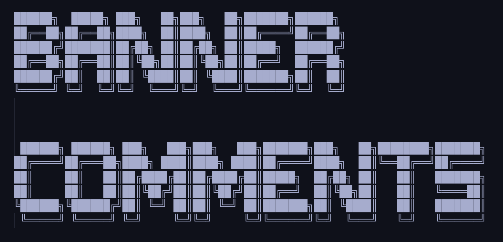
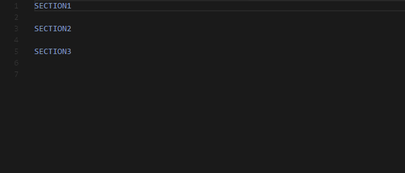
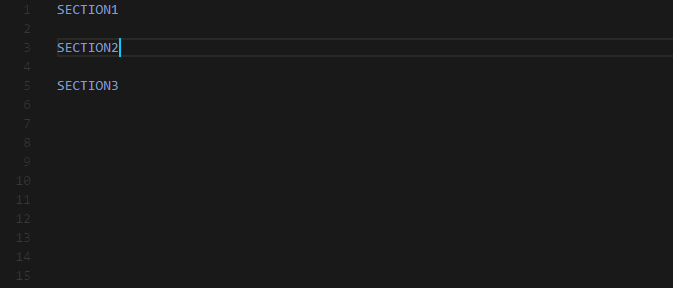

Converts the selected text into banners-comments "headers" using figlet.

**Table of Contents**

- [Features](#features)
  - [Apply](#apply)
  - [Set font](#set-font)
  - [Add to / remove from favorites](#add-to--remove-from-favorites)
- [Settings](#settings)
- [Known Issues](#known-issues)

## Features
-----------------------------------------------------------------------------------------------------------

### Apply

Transform selected text into a figlet font from either:
- "**Apply <h1|h2|h3> font**": A user-defined header type (h1, h2 or h3)
- "**Apply from list**": The list of available figlet fonts
- "**Apply from favorites**": A list of selected favorites

You can also enable `whitespaceBreak` and defined a desired `width` so the resulting comment wraps automatically (See [settings](#settings)).

**NOTE**: Also supports multi-line selections:

### Set font

Assign a font for the specified header type (h1, h2 and h3).

### Add to / remove from favorites

Add a font to the list of favorites so it's easily accessible later.

## Settings
-----------------------------------------------------------------------------------------------------------

This extension contributes the following settings:

* `banner-comments.h1`: "\<figlet font name\>"
* `banner-comments.h2`: "\<figlet font name\>"
* `banner-comments.h3`: "\<figlet font name\>"
* `banner-comments.favorites`: [ \<figlet font name\>, ... ]
* `banner-comments.figlet.horizontalLayout`: "\<default | full | fitted | controlled smushing | universal smushing\>"
* `banner-comments.figlet.verticalLayout`: "\<default | full | fitted | controlled smushing | universal smushing\>"
* `banner-comments.figlet.whitespaceBreak`: "\<true|false\>"
* `banner-comments.figlet.width`: "\<integer value (default 80)\>"

## Known Issues

- Only the languages provided by vscode are supported to wrap the banner with comments. Converting to figlet font should still work

-----------------------------------------------------------------------------------------------------------